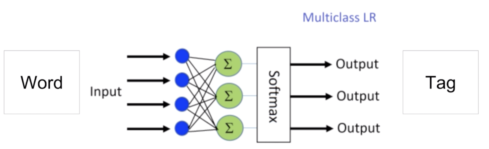

# How can neural networks be used to solve POS tagging

## Logistic Regression

- Does not capture sequence information

$$
p(tag|word) = softmax(W[\text{word_index}])
$$

- Why is it limited? It only creates a 1-to-1 mapping from word to tag

  - What if one word can have multiple tags?

  

### Recurrent Neural Network

 
$$
h(t)=\sigma(W^T_x x(t)+W_h^Th(t-1)+b)
$$

- A recurrent neural network in its simplest form looks almost like a feedforward neural network except that it has a **feedback loop** where the hidden layer goes back into itself.

- This allows the neural network to take into account data from past

- The way that it takes those previous words into account is by *multiplying by a matrix*.

  - $p(tag|"milk") \rightarrow$ Ambiguous!

  - $p(tag|"\text{I just drank a glass of milk}")\rightarrow$ clearly a noun

## LSTMs and GRUs

- More modern recurrent units

- Basically you can think of them as a little system of many neural networks, each formula is just its own logistic regression which is a neuron.
- These <u>units</u> help us learn **long term dependencie**s in the data and they help us avoid problems such as the **vanishing and exploding gradient**.

# POS Tagging Baseline

