# Attention Intro

2 different ways to approaching "many-to-one"

1. Pass the sequence through the RNN, and pass the final output through a dense layer to get a prediction conditioned on the **entire input sequence**.
2. We kown that LSTMs and GRUs can learn long-term dependencies ... but *how long?*
   - Doing a maxpool over RNN states is like doing a maxpool over CNN features - it's essentially saying "pick the most important feature"
   - By taking the last RNN state, we hope the RNN has both found the relevant feature <u>and</u> "rememvered" it all the way to the end

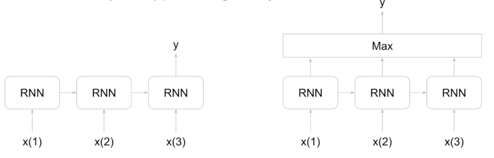 


**Another idea**

- Normal max ("hardmax") takes the max and forgets about everything else
- **Softmax** gives us a probability distribution over each element for "how much to care"


# Attention Theory

- The main theme: "Everything is a nerual network"
- Similar idea when we talked about GRUs:

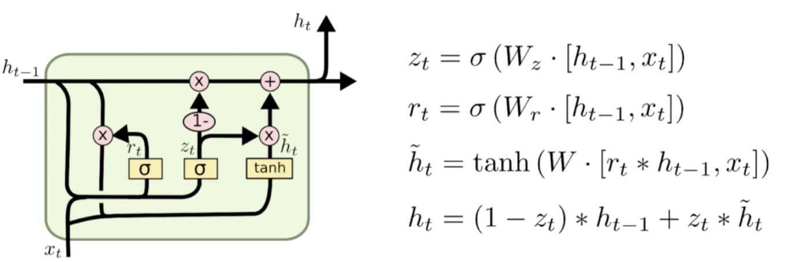


## Attention

- Still a seq2seq model, thus we still have an encoder and decoder
- Encoder is now a Bidirectional LSTM (output shape = $T_x \times 2M$)

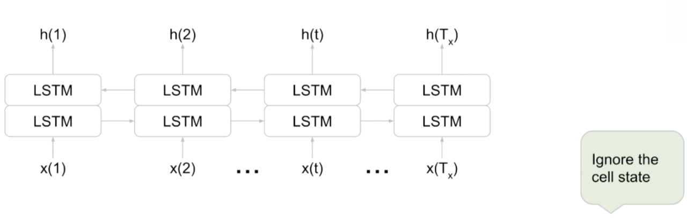

- After the encoder, we have the decoder, which takes $h$, and produces translation.


**Information retrieval**

Intuition: Taking a query, selecting the place where the highest likelihood to look for the key, then finding the key


### Inside the Attention Layer


**Scale dot product attention**

- The **attention mechanism** uses *encoded representations* of both the <u>input</u> (or the encoder hidden states) and the <u>outputs</u> (or the decoder hidden states). 

- The ***keys*** and ***values*** are pairs. 
  - Both of dimension $N$, where $N$ is the input sequence length and comes from the **encoder hidden states**. 
  - Keys and values have their own respective matrices, but the matrices have the same shape and are often the same. 

- The ***queries*** come from the **decoder hidden states**.

- Both the ***key value pair*** and the ***query*** enter the **attention  layer** from their places on opposite ends of the model. 
  - Once they're inside, the dot product of the ***query*** and the ***key*** is calculated. 
  - This is essentially a measure of ***similarity*** between them, and  the dot product of similar vectors tends to have a *higher* value.

- The **weighted sum** given to each value is determined by **the probability that  the key matches the query.** 
  -  Probability can be determined by running the attention weights through the **softmax**

- Then the ***query*** is mapped to the next ***key value pair*** and so on and so forth.


### Neural machine translation with attention

**Keys & queries:** a matrix with the words of one query (Q) as columns, and the words of the keys (K) as the rows

**Value score (V)** assigned based on the closeness of the match


### Flexible attention

For languages with different grammar structures, attention still looks at the correct token between them.


## Attention vs. Regular Seq2seq

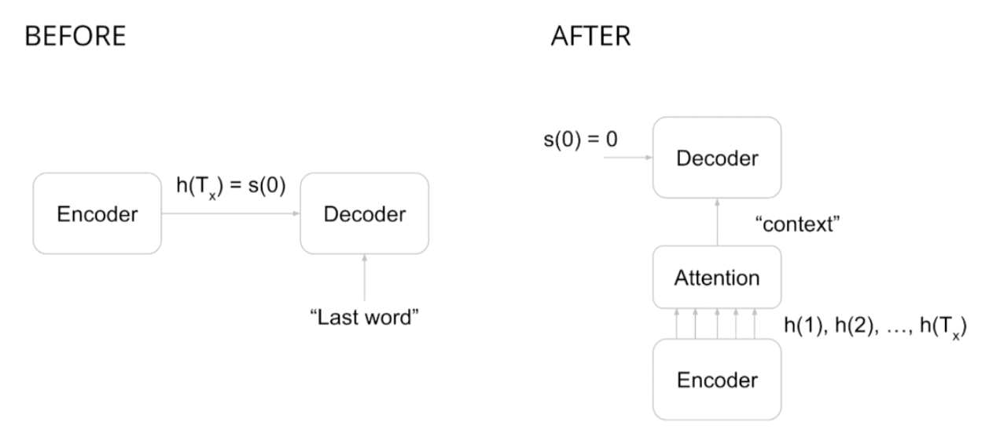

**BEFORE**

- We take the last hidden state from the encoder and pass that in as the initial state to LSTM.

**AFTER**

- With attention we no longer care only about $h(T_x)$, we care about all the $h$s. All the  $h$s are going to get fed into attention calculator
- **Attention calculator** is going to give us one final vector called the ***context*** which tells us which $h$ we care most about 


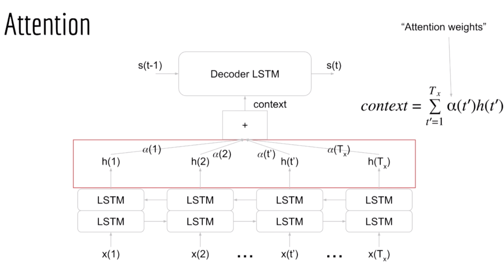


- Decoder LSTM is just regular LSTM.
  - We know that the LSTM should have two arrows going in: 
    - one from the side that we get from the previous state; 
    - one from the bottom which because we're doing attention now comes from the encoders hidden states 
  - B ut we know that the thing going into the bottom of the LSTM has to be a vector --> **context vector**.

#### **How to get context vector?**

**Context vector** is just the weighted average of all the hidden states from the decoder.

- Weight ($\alpha$) tells us how important each hidden state is for producing this particular output word.


#### How do we calculate $\alpha$ (attention weights)? 

>  A neural network!

- Note the different t's
  - $t$ is for the output sequence ($t=1...T_y$), telling me which output I'm currently trying to calculate.
  - $t^{'}$ is for the input sequence ($t^{'}=1...T_x$), telling me which $\alpha$ I'm currently calculating and how many $\alpha$ 's are there.
    - Remember that the $\alpha$ is just the weight for the state to tell us how much we care about that state right now.

- For a single step of the output($t$), we want to consider all steps of the input sequence, that is to look over <u>all</u> of the $h$'s ($t^{'}=1...T_x$)

  (I need an $\alpha$ for each one)

$$
\alpha_{t^{'}}=NeuralNet([s_{t-1},h_{t^{'}}]), t^{'}=1...T_x \\
context = \sum_{t^{'}=1}^{T_x} \alpha_{t^{'}}h_{t^{'}}
$$

- Input vector is concatenation of $s(t-1)$ and $h(t^{'})$ - why?

  - The **attention weights** depend on two things.
    1. The hidden states;
    2. Where I am in the output sequence
  - If we didn't condition  $s(t-1)$ and the  $\alpha$  depended only on the $h$'s then the **attention weights** would just be the same for every step.
  - We need information from the $s$'s because that gives us the context of where we are at the output

  

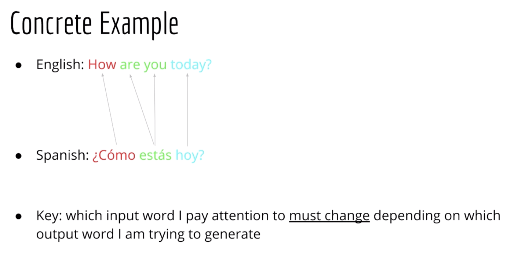


### Calculating attention weights

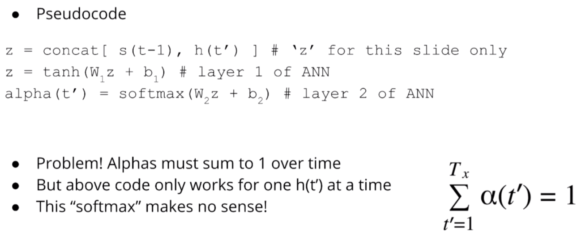

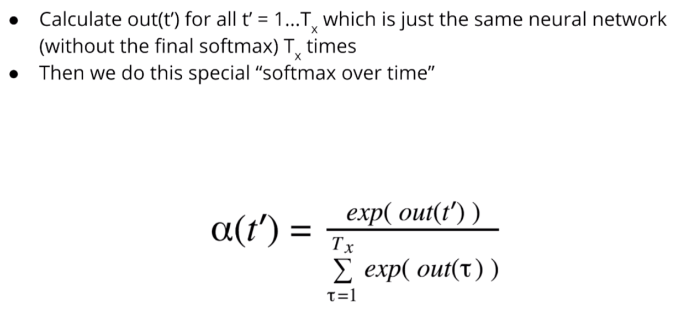

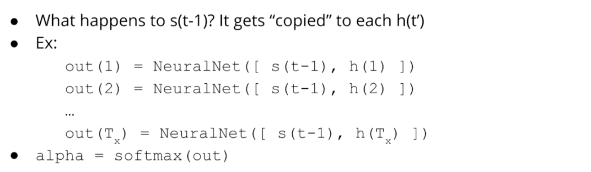

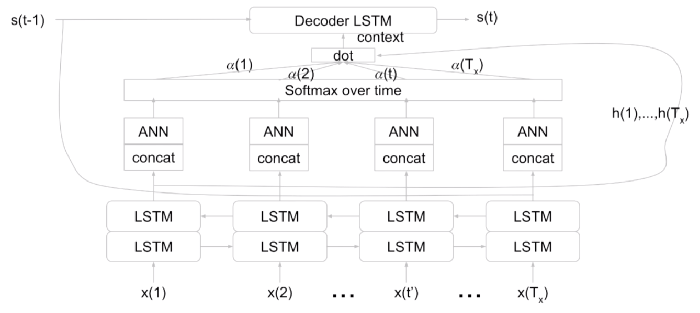

- $s(t-1)$ gets concatenated to each of the $h$'s
- Then those get passed through a neural network
- Then those neural network outputs get **softmax**ed.
- Then $\alpha$'s get dotted with the $h$'s to give us a weighted sum of the $h$'s 
- Then get **context** which gets passed into the bottom of decoder LSTM.


## Decoder

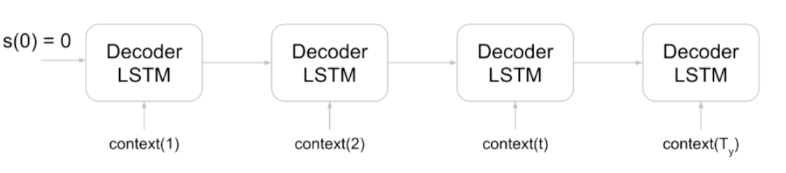

 

 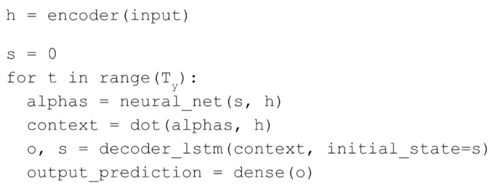


# Teacher Forcing

- What we did for attention is in conflict with teacher forcing, because now context goes in the bottom (instead of correct last word)


**Simple solution**: just concatenate them together

- Training: `input(t) = [context(t), target(t-1)]`
- Prediction: `input(t) = [context(t), y(t-1)]`

You can even pass this input into a dense layer first to shrink the dimensions

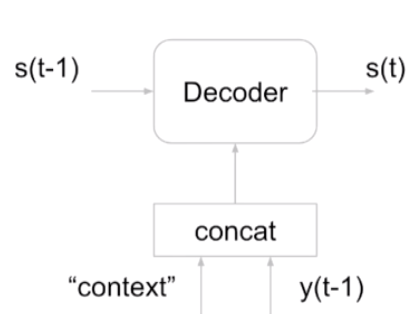


# Implementation Details

## Pre-built layers

- Interface issues
- At a high level, there are 3 components: encoder, attention, decoder
- Because of how attention works, the attention "layer" is tightly coupled to the decoder, hence you'd have to put both together as a single "layer"

## "Nested" Structure

- Regular decoder:

```python
x=LSTM(M, return_sequences=True)(x)
y=Dense(V)(x) # automatically runs Ty times
```

- Attention:

```
for each output step 1 ... Ty:
	alphas = attention(s,h) # already runs Tx times
	context = alphas.dot(h)
	output, s = lstm(context)
```

- Key: $s$ changes at each iteration, so it can't call be calculated at once


## Keeping track of shapes

**Encoder**:

- Suppose: LSTM has latent dimension = $M_1$
- Shape of $h(t^{'}) = 2M_1$, since we use a bidirectional LSTM.
- Shape of sequence of $h^{'}s=(T_x,2M_1)$, since the length of the input sequence is $T_x$

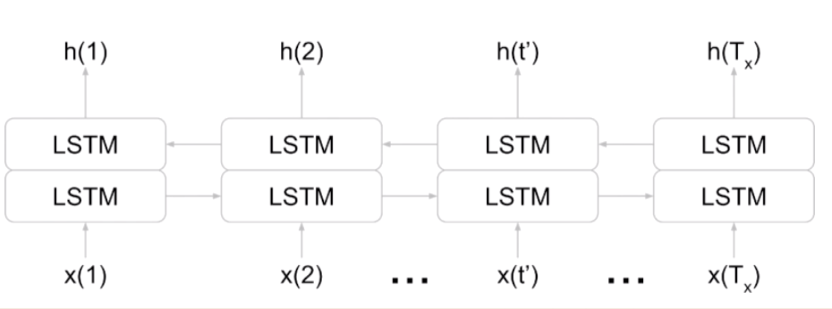


**Decoder**

- Suppose: latent dimension = $M_2$
- $S(t-1)$ Shape = $M_2$
- After concat: $[s(t-1),h(t^{'})]$ shape = $2M_1+M_2$

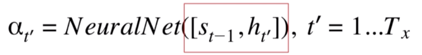

**Output**

- $\alpha(t^{'})$ shape =1
- Sequence of $\alpha$ shape: ($T_x,1$)


**Context**
$$
context = \sum_{t^{'}=1}^{T_x} \alpha_{t^{'}}h_{t^{'}}
$$

- $(T_x,1) \cdot (T_x,2M_1) \rightarrow (1,2M_1)$


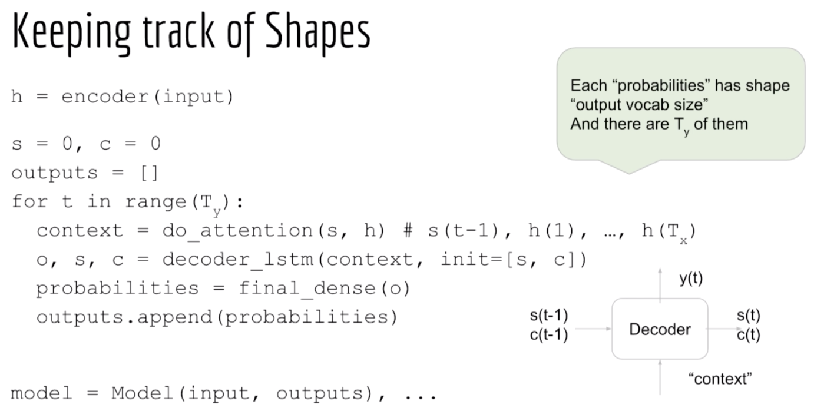

 


# Visualizing Attention

- "Outer" loop runs $T_y$ times, we need to calculate a new context vector each time
- "Inner" loop runs $T_x$ times, we need an attention weight for each of the hidden states $h(1),...,h(T_x)$
- Considering all calculations, we actually have $T_xT_y$ attention weights in total

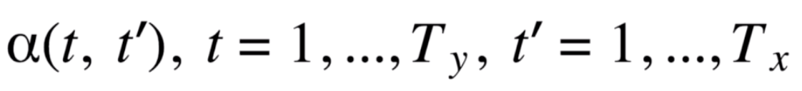

> A matrix of weights

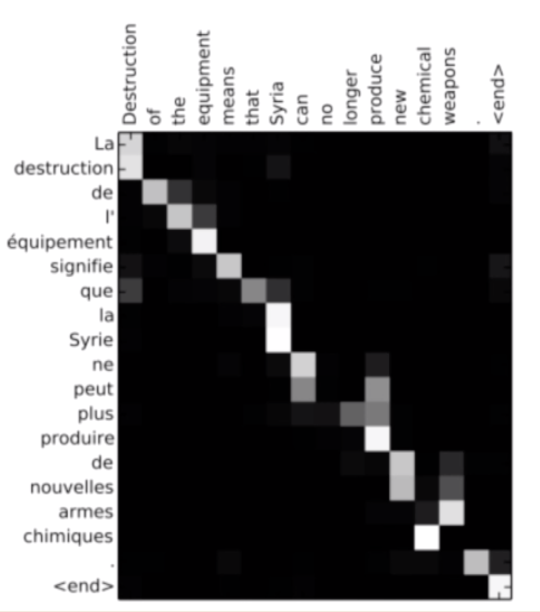


# Building a chatbot without any more code

## What is a chatbot

- An input-response machine
- Translation system has the same type of interface;
  - Input: sequence of words
  - Output: sequence of words
- Difference: ina chatbot output sequence is in the same language
- Format of data is the same
- Meaning no changes in code, only changes in data


# Summary

- **Attention** is an added layer that lets your model focus on the most important parts of the sequence for each step. 
- **Queries, values, and keys** are representations of the encoder and decoder hidden states, and used for **information retrieval** inside the attention layer by calculating **similarity** between the decoder queries and the encoder key-value pairs. 
- This flexible system finds matches between languages with very  different grammatical structures or alphabets. 

- Attention augments the regular Seq2Seq architecture

  - Limitation of regular seq2seq: 
    - Entire input sequence gets folded into 1 vector, the decoder then has to produce its output based on only that single vector. 
    - Since that single vector always has a *constant capacity*. This might be a problem when you have very **long sequences** .

  - Solution is to consider **all the hidden states** of the encoder rather than just the last one ($T_x$).
  - We need to weight them to determine which is important at each point in the output sequence.

  


# Training an NMT with Attention

## **Teacher forcing**

### How to know predictions are correct?

**Teacher forcing**  allows your model to use the ground truth, or the **actual outputs** from  your **decoder** to compare its predictions during training. 

-  **faster training** 
-  **higher accuracy**


### Motivation


- In a sequence model like this one, each wrong prediction makes the following predictions even less likely to be correct. 

- You need to have a way to check the *prediction* made at each step. 


- During training, the **predicted outputs** are not being used for predicting the next predicted green rectangle. Instead, the **actual outputs**, or ground-truth,  is the input to the decoder for each time step until the end of the sequence is reached.

- Without teacher forcing,  models can be **slow to reach convergence**.  

## Training NMT


1. The initial **select** makes two copies. Each of the **input tokens** represented by zero and the **target tokens** represented by one.

   (Here the *input* is English tokens,  and the *target* is German tokens)

   - One copy of the **input tokens** are fed into the **inputs encoder** to be  transformed into the ***key*** and ***value*** vectors. 
   - One copy of the **target tokens** goes into the **pre-attention decoder**.
     - **Pre-attention decoder** is  not the decoder which produces the decoded outputs. It is transforming the **prediction targets** into a different vector space called the **query vector**. That's going to calculate the relative weights to give each input weight. 

2. The **pre-attention decoder** takes the **target tokens** and shifts them one place to the right.
   - This is where the **teacher forcing** takes place. Every token will be shifted one place to the right, and in start of a sentence token, will be a **sign** to the beginning of each sequence.
3. Next, the **inputs** and **targets** are  converted to **embeddings** or initial representations of the words. 
   - Now that you have your ***query key and value*** vectors, you can prepare them for the **attention layer**. 
4. You will also apply a **padding mask** to help determine the **padding tokens**. The mask is used after the computation of the $Q$, $K^T$. 
5. The **residual block** adds the **queries** generated in the **pre-attention decoder** to the results of the **attention layer**.

6. The **attention layer** then outputs  its activations along with the **mask** that was created earlier.
7. **second Select** drops the **mask** before running everything through the decoder
   - It takes the **activations** from the **attention layer** or the zero,  and the second copy of the **target tokens**, or the two. These are the **true targets** which the decoder needs to compare against the predictions. 

8. Then run everything through a dense layer  with your **targets vocab size**. This gives your output the right size. 
9. Finally, you will take the **outputs** and run it through **LogSoftmax**, which is what transforms the **attention weights** to a distribution between zero and one. 
10. Pass down along with the **log probabilities** to be matched against the predictions.


# Attention is great 

- Attention significantly **improves NMT performance** 
  - It’s very useful to allow decoder to focus on certain parts of the source 
- Attention solves the **bottleneck** problem
  - Attention allows decoder to look directly at source; bypass bottleneck 
- Attention helps with **vanishing gradient** problem 
  - Provides shortcut to faraway states 
- Attention provides some **interpretability** 
  - By inspecting attention distribution, we can see what the decoder was focusing on 
  - We get (soft) **alignment** for free! 
  - This is cool because we never explicitly trained an alignment system 
  - The network just learned alignment by itself