# Background

1. Introduced by Google in 2014
2. Mapping **variable-length sequences** to  a fixed length memory. 
   - The inputs and outputs don't need to have matching lengths.

3. LSTMs and GRUs are typically used to overcome the **vanishing gradient problem**

# Seq2Seq Theory

**Seq2Seq** solves the problem of mapping an input sequence to an output sequence that has a different length.

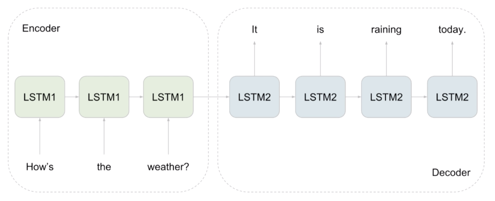

**Encoder**: take some raw input like text audio or an image, and create a little vector representation out of it.

- The orange rectangle represents the **encoders final hidden states**,  which tries to capture all the information collected from each input step, before feeding it to the **decoder**. 

- This **final hidden state** provides the initial states for the decoder to begin predicting the sequence.

**Decoder**: produce a new data from that compressed vector representation.

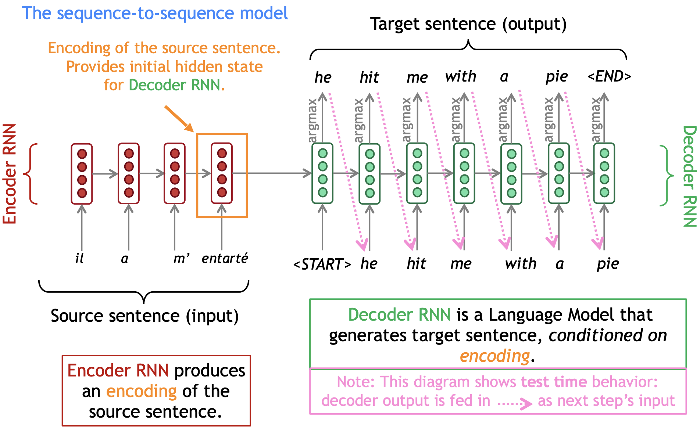

The **sequence-to-sequence** model is an example of a **Conditional Language Model**. 

- **Language Model** because the decoder is predicting the next word of the target sentence *y* 
- **Conditional** because its predictions are also conditioned on the source sentence *x*

## The Encoder

**Encoder**'s job is to fold up the input sequence into a small but useful and *informative vector*, then the **Decoder**'s job is to unfold that vector into a new sequence.

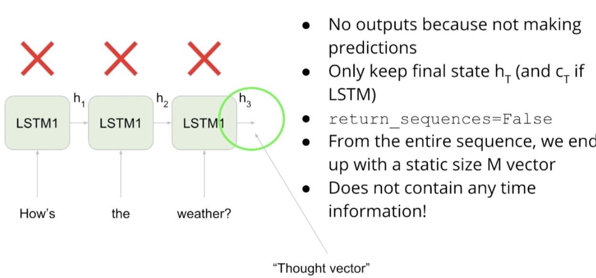

- **Thought vector**: a small compact **representation** of the original input

## The Decoder

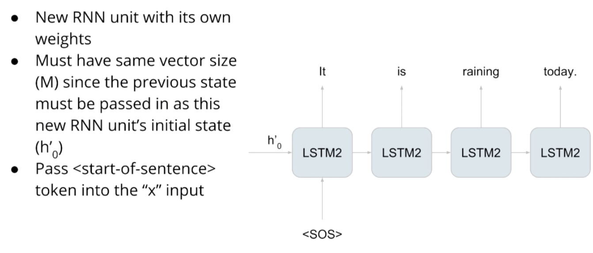

**Decoder** has an entirely new RNN unit with the same size as the **encoder**. Instead of passing in any old initial state into the **decoder** RNN, we pass in **thought vector** from earlier.

- For the first input $x_1$, pass in a special token to denote the ***start of a sentence***.

- From this information $h_0$ and $x_1$, RNN is going to calculate $h_1$ and from that we can calculate $y_1$ (a vector of probabilities).

- Take the $argmax$ to pick the most likely word in our target language.

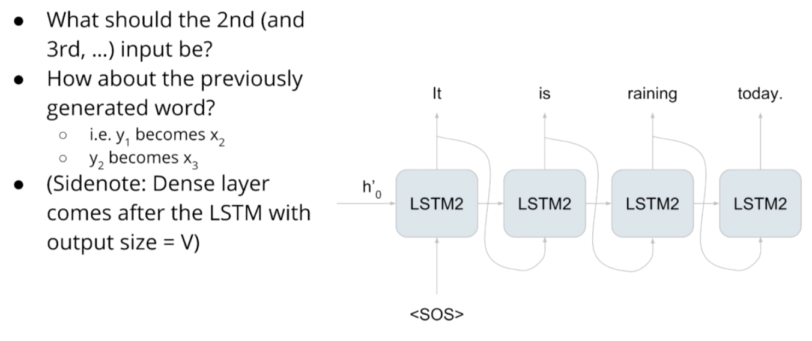

# Seq2Seq Applications

- Summarization (long text → short text) 
- Parsing (input text → output parse as sequence)
- Code generation (natural language → Python code)
- **Chatbot**
  - Seq2Seq is not well-suited to Chatbots
  - Real conversations involve an idea spanning multiple back-and-forth statements by the agents involved - can even return to a previous topic much later
  - Conversation with only binary q&a pairs is awkard
  - A decent chatbot should remember not only what you said in the past but also what it said itself.
  - Seq2Seq only learns to **memorize** the request-response pairs

 

# Decoding in Detail and Teacher Forcing

Remember that each RNN unit has **two inputs** and **one output**. 

The decoder has two inputs: 

1. the previous hidden state 
2. an input sequence

But what goes here at the bottom?

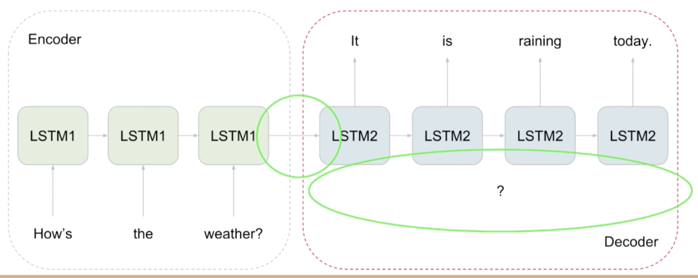

As previous lecture said, we could take the **previously generated word** and feed that into the input at the next timestep.

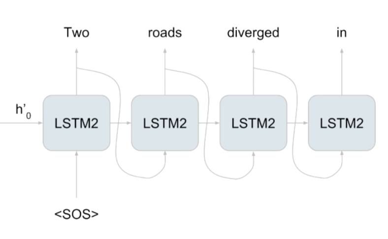

**Better Alternative**: ***Teacher forcing***

## Teacher forcing

- Instead of feeding the **previously generated input** into the bottom of the decoder, **Teacher forcing** feeds in the **true target** sequence (offset by <SOS>).
- Even if your model didn't get the previous word right, teacher forcing corrects it.

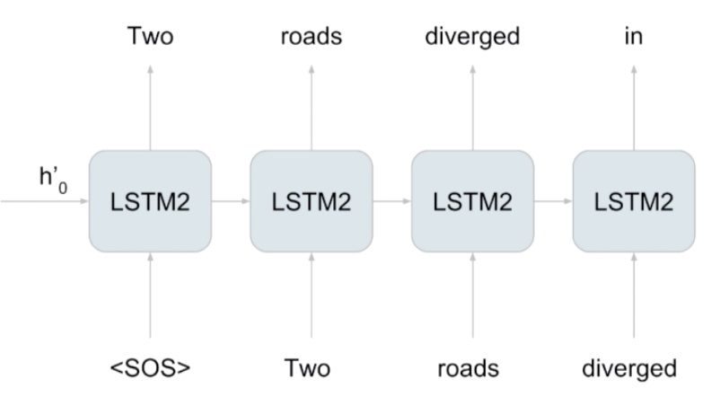

- This helps the model to **train** because it would be difficult for the model to learn  the entire sentence at once.

- Note: you MUST offset by <SOS>
  - If you don't, then  the input word will simply match the output word and the RNN will simply learn to copy it - useless!

# Training a Neural Machine Translation system

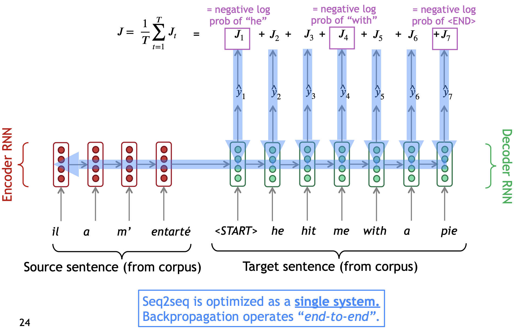

# Sampling and Decoding

2 ways to construct the translated sentence:

1. **greedy decoding**
2. **random sampling**

> when choosing the word  with the highest probability at every time, that does not necessarily generate the best sequence.

## Greedy decoding

- Greedy decoding is the simplest way to decode the model's predictions as it **selects the most probable word at every step** by taking argmax.

- **Limitation**: 
  - The best word at each step may not be the best for *longer sequences*
  - Greedy decoding has no way to undo decisions! 

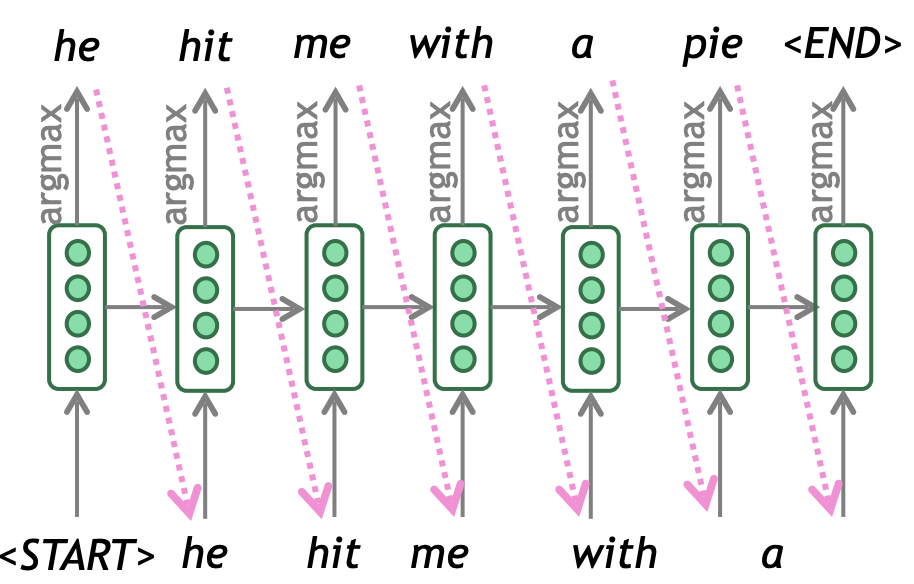

## Random sampling

- Random sampling **provides probabilities** for each word, and sample accordingly for the next outputs.

- Limitation: a little too random for accurate translation!

- Solution: assign more weight to more probable words, and less weight to less probable words

### Temperature

In sampling, **Temperature** is a parameter you can adjust to allow for more or less **randomness** in your predictions. 

- It's measured on a scale of 0-1, indicating low to high randomness.

- Lower temperature setting = More confident, conservative network
- Higher temperature setting = More excited, random network (and more mistakes)

## Beam search decoding

- <u>Core idea</u>: On each step of decoder, keep track of the ***k most probable*** partial translations (which we call ***hypotheses***) 
  - ***k*** is the **beam size** (in practice around 5 to 10) 
- A ***hypothesis*** has a **score** which is its *log probability*: 
  - Scores are all negative, and higher score is better 
  - We search for high-scoring hypotheses, tracking top k on each step

$$
score(y_1,...y_t) = \log{P_{LM}(y_i|y_1,...,y_{i-1},x)}
$$

- Beam search is **not guaranteed** to find optimal solution 
- But much more *efficient* than exhaustive search!

- Instead of offering a <u>single</u> best output like in **greedy decoding**, Beam seach decoding selects <u>multiple</u> options for the best input based on conditional probability
- Number of options depends on a predetermined beam width parameter $B$
- Selected $B$ number of best alternatives at each time step

### Example

- A larger beam width will give you better model performance but slower decoding speed. 
- Provided with the first token I, and the beam width parameter of 3, beam search assigns conditional probabilities to each of several options for the next word in the sequence. 
- The highest probability is the one that will be chosen for each time step, and the other options will be pruned.

### Problems with beam search

- Since the model learns a distribution, that tends to carry more weight than single tokens
- Can cause translation problems, i.e. in a speech corpus that hasn't been cleaned

#### Minimum Bayes Risk (MBR)

Compares many samples against one another. To implement MBR:

- Generate several random samples
- Compare each sample against all the others and assign a similarity score (such as ROUGE)
- Select the sample with the highest similarity: **the golden one**

# Evaluation for Machine Translation

## BLEU

**BLEU** compares the <u>machine-written translation</u> to one or several <u>human-written translation(s)</u>, and computes a **similarity score** based on: 

- ***n-gram precision*** (usually for 1, 2, 3 and 4-grams) 
- Plus a penalty for too-short system translations 

### Shortcomings

- BLEU doesn't consider semantic meaning
- BLEU doesn't consider sentence structure

## ROUGE

- Evaluates quality of machine text
- **Recall-oriented** by default

- The **ROUGE score** calculates *precision*, and *recall* for a machine texts by counting  the *n-gram overlap* between  the machine texts and a human-created texts. 
  - Recall that's an n-gram,  is a list of words that appear next to each other in a sentence where the order matters

**Recall**: How many of the reference words gets predicted by the model? 

**Precision**: How much of the model text is relevant?

## Summary

## The Problem

- Keras works with constant-sized sequences $T_y$.
  - If input is of length 100 then our output will also be of length 100.
- During training, we always pass in  the <u>true target</u>, a sequence of length $T_y$
- During prediction, we can't!

### Test Mode

- For prediction, we want to pass in the previous output as the next input
- Sequence length is 1!
- We can't pass in $T_y$ values all at once if they haven't been generated yet.

### The problem summary

1. Keras must have constant-sized inputs
2. Decoder input length during training is $T_y$ if you are using Teacher forcing.
3. Decoder input length during prediction is 1

These are both in conflict with 1.

## The Solution

- Create 2 different models
  - Model I: For training purpose only
  - Mdoel II: For sampling and make use of the previously defined decoding layers

 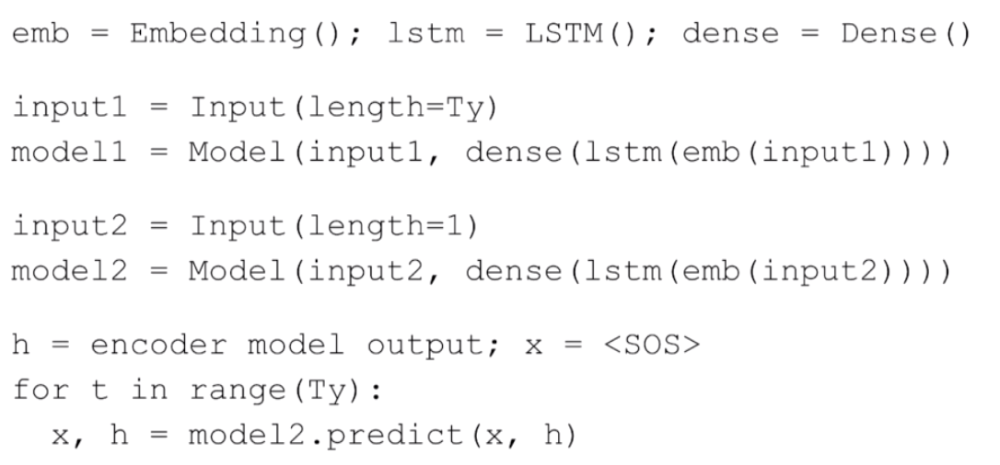

- Both `model1` and `model2` use the same layers defined at the beginning.
- The only difference is that they have a different input.

# Poetry Revisited

## Language Modeling

- Poetry generation is just an instance of language modeling (next word prediction)
- We want $p(w_t |w_{t-1},w_{t-2},...)$

## Structure of Data

- Build a model like this teaches the RNN model to predict the next word in a sentence
- We can then use that model to *sample* from  $p(w_t |w_{t-1},w_{t-2},...)$ to get an entirely *new sentence*.

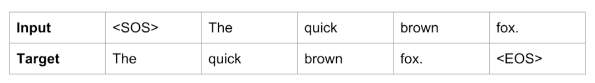

## What should this remind you of?

- Looks exactly like seq2seq decoder with **teacher forcing**!
  - The input sequence is the true translation, and target sequence is the same translation offset by one.
- The difference is:
  - In seq2seq, $h_0^{'}$ is the encoder's output
  - Here, it's just 0

## Conclusion

- By writing code for language modeling, we write the exact code we need for the decoder in seq2seq

# Seq2seq shortcomings

### The information bottleneck

1. **longer sequences**: because Seq2Seq uses a fixed length memory, longer inputs become bottlenecked on their way to the decoder.

2. The later input steps in the sequence  are given more importance

*fixed size encoder hidden states* struggles to **compress longer sequences**,  and ends up throttling itself and **punishing the decoder**.

> How could you build a time and  memory efficient model that predicts accurately from a long sequence?

### Solution: focus attention in the right place

- Prevent *sequence overload* by giving the model a way to focus on the ***likeliest*** words each step

- Do this by providing the information specific to each input word

# Alignment

**Alignment** is the correspondence between particular words in the translated sentence pair.

- *Typological differences* between languages lead to complicated alignments! 
- Note: Some words have ***no counterpart***

## Learning alignment for SMT

- We learn $P(x,a | y)$ as a combination of many factors, including: 
  - Probability of particular words aligning (also depends on position in sentence) 
  - Probability of particular words having particular fertility (number of corresponding words) 

## Word alignment

- **Word alignment**: model needs to identify relationships among the words.

- To be able to align the words correctly, add an attention layer which performs a series of calculations that's **assigned some inputs more weights than others** to help the decoder understand which inputs are more important for each prediction. 

1. Get all of the available hidden states ready for  the encoder and do the same for the first hidden states of the decoder.

2. Score each of the encoder hidden states by getting its dot product between each **encoder state** and **decoder hidden states**.
   - If one of the scores is higher than the others, it means that this hidden state will have more influence than the others on the output. 

3. Run scores through **softmax**, so each score is transformed to  a number between 0 and 1, this gives you your **attention distribution**.
4. Take each **encoder hidden state**, and multiply it by its **softmax score**, this results in the **alignments vector**.
5. Add up everything in the **alignments vector** to arrive at **context vector** (what you feed into the decoder).

